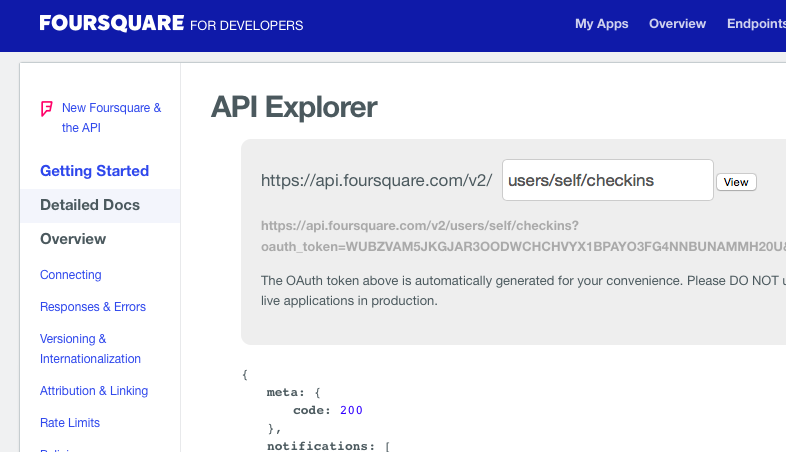
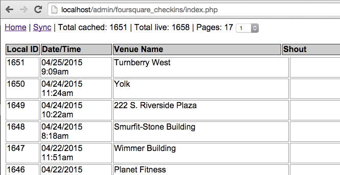

# Foursquare to MySQL

This script will fetch your Foursquare checkins and insert them into a MySQL database (using PHP). It will also display a HTML webpage of every checkin, with various options (like viewing the raw photos, etc).

## Installation

To get started, create a file called `auth_token.php` and put it in the same directory as the `index.php` file (from this repository). The contents of `auth_token.php` should be

	<?php

		// your Foursquare auth token.
		$auth_token = "NDASDUI38NSDKOISDJASDNAHYEREA32ISDS";

	?>
	
To get your Foursquare auth token, [go here](https://developer.foursquare.com/docs/explore#req=users/self/checkins) and copy it from the example:

## Usage

The script will fetch photos from your Foursquare posts and save those to the database. It currently only takes the first **two** photos that you post (per checkin).

The script can only process 250 checkins per sync run, so you'll have to initally click "Sync" a few times (if you have a lot of checkins).

Here is the database table structure:

	CREATE TABLE `checkins` (
		`id` int(11) unsigned NOT NULL AUTO_INCREMENT,
		`foursquare_id` varchar(75) NOT NULL DEFAULT '',
		`dt_unix` int(11) unsigned NOT NULL,
		`dt_sql` datetime NOT NULL,
		`venue_id` varchar(75) NOT NULL DEFAULT '',
		`venue_name` varchar(250) NOT NULL DEFAULT '',
		`shout` varchar(250) DEFAULT NULL,
		`venue_location` text,
		`latitude` varchar(50) NOT NULL DEFAULT '',
		`longitude` varchar(50) NOT NULL,
		`venue_categories` varchar(250) DEFAULT NULL,
		`photo1_url` varchar(250) DEFAULT NULL,
		`photo1_data` mediumblob,
		`photo2_url` varchar(250) DEFAULT NULL,
		`photo2_data` mediumblob,
		PRIMARY KEY (`id`),
		KEY `venue_name` (`venue_name`),
		KEY `foursquare_id` (`foursquare_id`),
		KEY `shout` (`shout`)
	) ENGINE=InnoDB DEFAULT CHARSET=utf8;